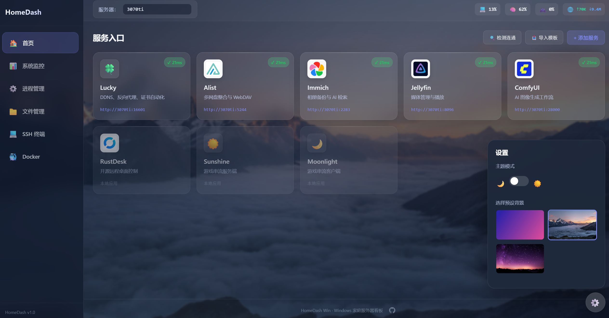

# 🖥️ HomeDash Win

> 轻量级 Windows 家庭服务器看板

HomeDash Win 是一个专为 Windows 家庭服务器设计的综合看板工具，提供**服务入口管理**、**实时系统监控**、**文件管理**、**Web 终端**和 **Docker 管理**等功能，让你轻松管理家庭服务器上的所有服务。



---

## ✨ 功能特性

### 核心功能

| 功能 | 描述 |
|------|------|
| 🎯 **服务入口管理** | 自由添加、编辑、删除服务卡片，支持一键导入推荐模板 |
| 🔍 **连通性检测** | 实时检测服务状态（绿色=正常，黄色=延迟高，红色=不可用） |
| 🖼️ **Favicon 自动抓取** | 输入端口后自动获取目标服务的网站图标 |
| 📊 **实时系统监控** | WebSocket 实时推送 CPU、内存、GPU、磁盘使用情况 |
| 🌡️ **温度监控** | 实时显示 CPU 和 GPU 温度，高温预警 |
| ⚙️ **进程管理** | 查看系统进程列表，按 CPU/内存占用排序（Top 20） |
| 📁 **文件管理** | WebDAV 服务端 + 可视化文件管理器，支持浏览、上传、下载、删除文件 |
| 💻 **Web SSH 终端** | 集成式 Web 终端，类似 Xshell 体验，支持命令历史、快捷键 |
| 🐳 **Docker 管理** | 查看 Docker 容器列表和状态，支持镜像查看 |
| 🔧 **WebDAV 配置** | 可自定义 WebDAV 挂载目录，支持通过 WebDAV 协议访问文件 |

---

## 📸 界面预览


---

## 🚀 快速开始
```powershell
# 克隆项目
git clone https://github.com/flyingrtx2333/HomeDash-Win.git
cd HomeDash-Win

# 安装依赖
go mod tidy

# 运行
go run ./cmd/homepage

# 或编译后运行
go build -o homedash.exe ./cmd/homepage
./homedash.exe
```

### 访问面板

打开浏览器访问 `http://localhost:29678`

默认端口 `29678`，可通过环境变量修改：

```powershell
$env:PORT="8080"; ./homedash.exe
```

## ⚙️ 配置说明

### 连通性检测规则

| 状态 | 延迟 | 显示 |
|------|------|------|
| ✓ 正常 | < 200ms | 绿色 |
| ⚠ 延迟 | 200-1000ms | 黄色 |
| ✗ 错误 | > 1000ms 或连接失败 | 红色 |

### 服务配置 (services.json)

```json
[
  {
    "id": "alist",
    "name": "Alist",
    "description": "多网盘整合",
    "port": 5244,
    "icon": "/static/icons/abc123.ico",
    "enabled": true
  }
]
```

### 用户设置 (settings.json)

```json
{
  "serverIp": "192.168.1.100",
  "backgroundUrl": "/static/backgrounds/default.jpg",
  "theme": "dark",
  "webdavRoot": "C:\\Users\\Public"
}
```

### WebDAV 配置

WebDAV 服务默认挂载到用户主目录，可通过以下方式配置：

1. **通过 Web 界面**：在「文件管理」页面顶部设置挂载目录
2. **通过环境变量**：设置 `WEBDAV_ROOT` 环境变量
3. **通过设置文件**：在 `settings.json` 中设置 `webdavRoot` 字段

WebDAV 访问地址：`http://localhost:29678/webdav/`

支持所有标准 WebDAV 客户端（Windows 资源管理器、RaiDrive、rclone 等）。

---

## 🔧 开机自启

创建 VBS 脚本放入 `shell:startup`：

```vbscript
Set ws = CreateObject("Wscript.Shell")
ws.CurrentDirectory = "C:\path\to\HomeDash-Win\"
ws.run "HomeDash.exe", 0
```

或者使用任务计划程序创建开机自启任务。

---

## 💡 使用技巧

### WebDAV 挂载

1. 在「文件管理」页面设置挂载目录
2. 复制 WebDAV 地址（格式：`http://服务器IP:29678/webdav/`）
3. 在 Windows 资源管理器中：
   - 右键「此电脑」→「添加网络位置」
   - 输入 WebDAV 地址
   - 完成挂载

### SSH 终端快捷键

- `Enter` - 执行命令
- `↑/↓` - 浏览命令历史
- `Ctrl+L` - 清屏
- `Ctrl+C` - 中断当前命令

### 主题切换

点击右下角设置按钮，可切换深色/浅色主题，所有页面自动适配。

---

## 📚 推荐搭配

以下是一些适合家庭服务器的优秀开源项目：

| 项目 | 用途 | 链接 |
|------|------|------|
| Lucky | DDNS + 反向代理 | https://lucky666.cn |
| Alist | 网盘聚合 | https://alist.nn.ci |
| Jellyfin | 媒体服务器 | https://jellyfin.org |
| Immich | 照片备份 | https://immich.app |
| Sunshine | 游戏串流 | https://github.com/LizardByte/Sunshine |

---

## 🛠️ 技术栈

- **后端**：Go 1.22+ (Gin, Gorilla WebSocket, golang.org/x/net/webdav)
- **前端**：原生 HTML/CSS/JavaScript (SPA)
- **系统监控**：gopsutil (CPU、内存、磁盘、网络)
- **GPU 监控**：nvidia-smi (NVIDIA 显卡)
- **Docker**：Docker CLI

---

## 📜 许可证

[MIT License](LICENSE)

---

<p align="center">
  <sub>Made with ❤️ by <a href="https://github.com/flyingrtx2333">@flyingrtx2333</a> for home server enthusiasts</sub>
</p>
