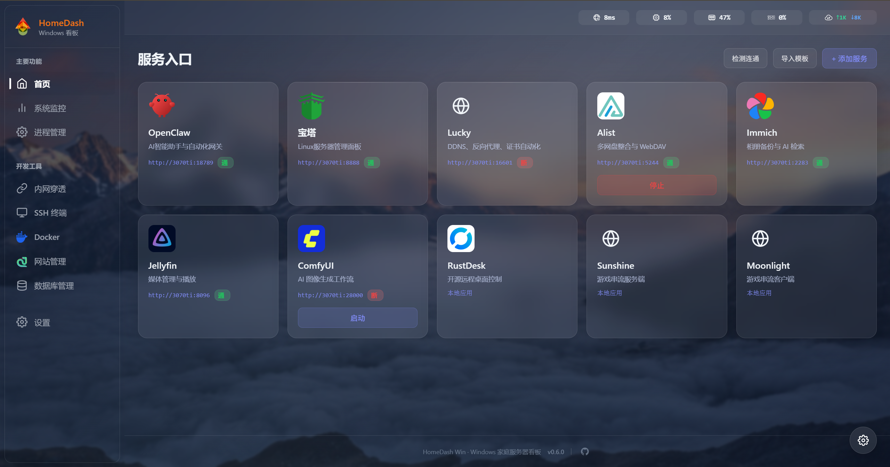
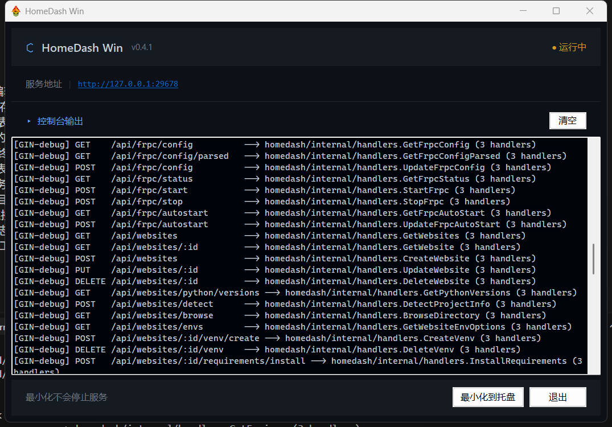
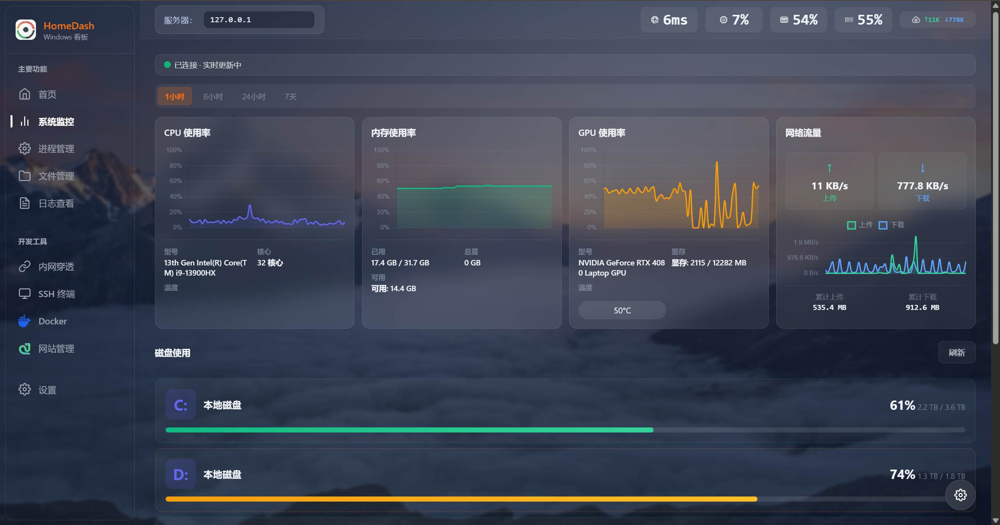
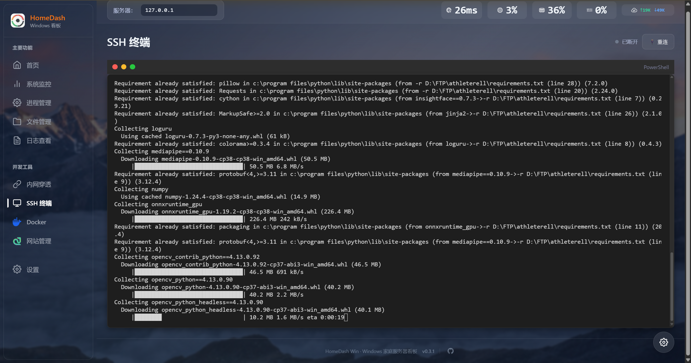
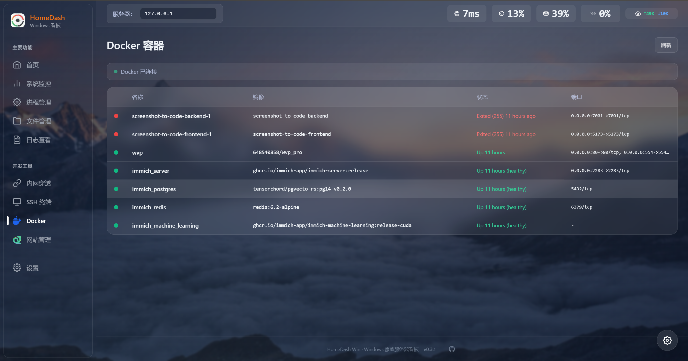
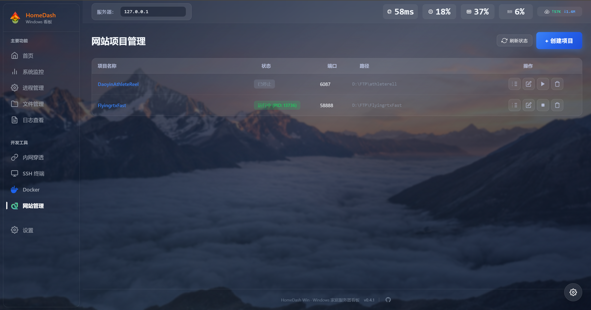
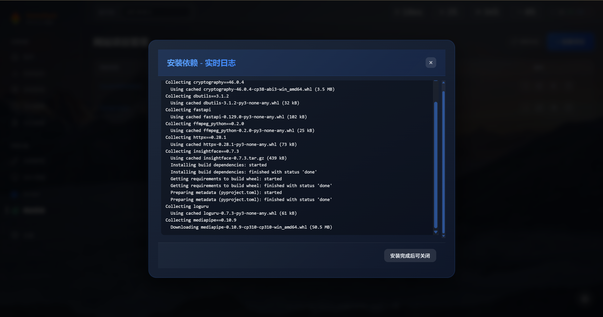

# 🖥️ HomeDash Win

> 轻量级 Windows 系统看板，一屏掌控服务、监控、文件与终端。

**HomeDash Win** 是专为 Windows 系统打造的一站式管理面板：集中管理各类应用服务入口、实时查看硬件与进程、内网穿透、Web 终端、Docker、Python 网站项目与 MySQL 数据库等，配合多路由独立页面与模块化前端，兼顾易用与可维护。



## 🆕 更新日志 (V0.6.0)
- 架构重构

---

## ✨ 核心功能概览

| 模块 | 能力简述 |
|------|----------|
| **服务入口管理** | 添加/编辑/删除服务卡片，连通性检测、Favicon 抓取、图标自定义、启动/停止与开机自启 |
| **系统硬件监控** | CPU/内存/GPU/磁盘/网络实时数据，WebSocket 推送、曲线图、时间范围、温度与系统信息 |
| **系统进程监控** | 进程列表、搜索/筛选/排序、批量操作、详情查看与结束进程 |
| **内网穿透** | 基于 FRP 的配置管理与启停、状态查看、开机自启 |
| **SSH 终端** | 集成 Web 终端，命令历史、快捷键，类 Xshell 体验 |
| **Docker 监控** | 容器列表与状态、镜像查看 |
| **文件管理** | WebDAV 服务端 + 可视化文件管理：浏览、上传、下载、删除、挂载目录配置 |
| **Python 网站管理** | 项目检测、venv 创建/删除、依赖安装、启动/停止、日志与端口配置 |
| **MySQL 数据库管理** | 连接配置、测试/改密、导出/导入 SQL、备份与备份策略 |
| **日志查看器** | 多服务日志、按级别过滤、自动刷新、清空 |

---

## 📸 界面预览
程序UI界面带有日志功能，可最小化到任务栏，看板通过浏览器访问：


### 首页服务入口


### 监控页面


### SSH 终端


### Docker查看


### 网站项目管理
网站管理功能目前支持python开发的框架管理

支持简易的venv环境管理


---

## 🚀 快速开始

在release中下载最新版本exe直接运行即可

或者对于对源码感兴趣的童鞋：
```powershell
# 克隆项目
git clone https://github.com/flyingrtx2333/HomeDash-Win.git
cd HomeDash-Win

# 安装依赖
go mod tidy

# 运行
go run ./cmd/homedash

# 或编译后运行
go-winres make --in winres/winres.json --out cmd/homedash/rsrc
go build -ldflags "-H windowsgui -s -w" ./cmd/homedash/
./homedash.exe
```

### 访问面板

打开浏览器访问 `http://localhost:29678`

默认端口 `29678`，可通过环境变量修改：

```powershell
$env:PORT="8080"; ./homedash.exe
```

## 📦 模块说明与技术栈

### 1. 服务入口管理

**功能**：将家庭服务器上的各类服务（Web 应用、本地程序等）以卡片形式集中展示，统一入口与状态。

- 自由添加、编辑、删除服务卡片，支持名称、描述、端口、图标、启动命令、工作目录等配置
- **连通性检测**：定时/手动检测服务可达性，状态标识（绿色正常、黄色延迟、红色不可用）
- **Favicon 自动抓取**：按端口或地址自动获取网站图标
- **图标自定义**：上传图片、拖拽上传或 Emoji 选择
- **启动/停止**：配置可执行路径与进程名后，支持一键启动与停止，并显示进程运行状态
- **开机自启**：为每个服务单独配置是否随系统启动

**技术栈**：Go 后端 REST API（Gin）、前端多路由页面 + 首页脚本（服务列表与弹窗）、进程检测（gopsutil / 进程名匹配）。

---

### 2. 系统硬件监控

**功能**：实时查看本机 CPU、内存、GPU、磁盘、网络等资源使用情况，并支持历史趋势与系统信息概览。

- **实时数据**：WebSocket 推送，顶部栏展示网页延迟、CPU/内存/GPU 占用、网络上下行
- **监控页图表**：CPU、内存、GPU、网络流量实时曲线，可切换 1 小时 / 6 小时 / 24 小时 / 7 天
- **温度与系统信息**：CPU/GPU 温度（若可用）、操作系统、运行时间、进程数、负载等
- **磁盘详情**：各盘符使用率、进度条与颜色区分

**技术栈**：Gorilla WebSocket、gopsutil（CPU/内存/磁盘/网络）、NVIDIA 显卡通过 `nvidia-smi` 解析、前端 Chart.js 绘图。

---

### 3. 系统进程监控

**功能**：查看与管理系统进程，便于排查高占用或结束异常进程。

- 进程列表展示（名称、PID、CPU、内存、用户、状态、路径等）
- **搜索 / 筛选 / 排序**：按名称、CPU、内存等条件筛选与排序
- **批量操作**：多选后批量结束进程
- **详情与单进程结束**：查看单进程详情并支持结束进程

**技术栈**：Go 后端拉取进程列表（gopsutil），前端进程管理页独立脚本，表格渲染与交互。

---

### 4. 内网穿透

**功能**：基于 FRP 的内网穿透配置与运行管理，便于从外网访问家庭内网服务。

- 查看与编辑 FRP 客户端配置（TOML）
- 启动 / 停止 FRP 客户端进程
- 查看运行状态与解析后配置
- 配置 FRP 是否开机自启

**技术栈**：Go 读写 FRP 配置文件、调用 frpc 进程启停、前端 frpc 页独立脚本与轮询状态。

---

### 5. SSH / Web 终端

**功能**：在浏览器中直接使用终端，无需单独 SSH 客户端，适合临时登录与简单运维。

- 集成式 Web 终端，支持命令输入、输出与基本交互
- 命令历史、快捷键等类 Xshell 体验
- 基于 WebSocket 的实时双向通信

**技术栈**：Gorilla WebSocket、Go 端 PTY（模拟终端）、前端 terminal 页 + xterm.js（或同等终端库）渲染。

---

### 6. Docker 监控

**功能**：查看本机 Docker 容器与镜像信息，便于掌握容器运行状态。

- 容器列表：名称、镜像、状态、端口等
- 镜像列表查看
- 状态与连接检测（Docker 是否可用）

**技术栈**：Go 调用 Docker CLI 或 Docker API 获取容器/镜像列表，前端 Docker 页独立脚本展示。

---

### 7. Python 网站项目运行管理

**功能**：对 Python Web 项目进行统一管理：检测框架、管理虚拟环境、安装依赖、启停与看日志。

- **项目检测**：选择目录后自动识别框架（如 Flask、Django 等）与建议配置
- **虚拟环境**：创建/删除 venv，选择系统已安装的 Python 版本
- **依赖安装**：按 `requirements.txt` 在 venv 中安装依赖
- **启动/停止**：配置启动命令与端口，一键运行或停止，并查看运行状态
- **日志**：实时查看/清空项目输出日志，支持 WebSocket 流式输出
- **工作目录**：支持为项目指定工作目录

**技术栈**：Go 后端执行 Python/venv 相关命令、项目检测与配置接口、前端 websites 页独立脚本；日志可选 WebSocket 推送。

---

### 8. MySQL 数据库管理

**功能**：管理多个 MySQL 连接，执行常用维护操作与备份。

- **连接管理**：添加/编辑/删除数据库连接配置，测试连接、修改密码
- **导出/导入**：导出为 SQL 文件、从 SQL 文件导入
- **表列表**：查看指定库下的表
- **备份**：创建备份、查看/下载/删除备份文件
- **备份策略**：配置自动备份（周期、保留策略等）

**技术栈**：Go 使用 `database/sql` + MySQL 驱动连接数据库；文件与备份落盘；前端 database 页独立脚本。

---

### 其他

- **文件管理**：WebDAV 服务端（`golang.org/x/net/webdav`）+ 可视化文件管理页（浏览/上传/下载/删除/新建目录、挂载目录配置），前端 webdav 独立脚本。
- **日志查看器**：多服务日志聚合、级别过滤、自动刷新、清空，后端按服务读文件或流式输出。
- **应用设置**：端口、主题、背景、WebDAV 根目录、更新检查等，与主布局共用基础脚本。

---

## 📚 推荐搭配

以下是一些适合家庭服务器的优秀开源项目：

| 项目 | 用途 | 链接 |
|------|------|------|
| Lucky | DDNS + 反向代理 | https://lucky666.cn |
| Alist | 网盘聚合 | https://alist.nn.ci |
| Jellyfin | 媒体服务器 | https://jellyfin.org |
| Immich | 照片备份 | https://immich.app |
| Sunshine | 游戏串流 | https://github.com/LizardByte/Sunshine |

---

## 🛠️ 技术栈

| 层级 | 技术 |
|------|------|
| **后端** | Go 1.22+、Gin 路由与 API、Gorilla WebSocket、golang.org/x/net/webdav |
| **前端** | 原生 HTML/CSS/JavaScript，多路由独立页面，按页加载脚本（base + 各模块 js） |
| **模板** | Go html/template，服务端按路由渲染不同内容块 |
| **系统监控** | gopsutil（CPU、内存、磁盘、网络、进程） |
| **GPU 监控** | nvidia-smi 输出解析（NVIDIA 显卡） |
| **Docker** | Docker CLI / API 调用 |
| **数据库** | database/sql + MySQL 驱动 |
| **图表** | Chart.js（监控页曲线） |

---
 

## 📜 许可证

[MIT License](LICENSE)

---

<p align="center">
  <sub>Made with ❤️ by <a href="https://github.com/flyingrtx2333">@flyingrtx2333</a> for home server enthusiasts</sub>
</p>
