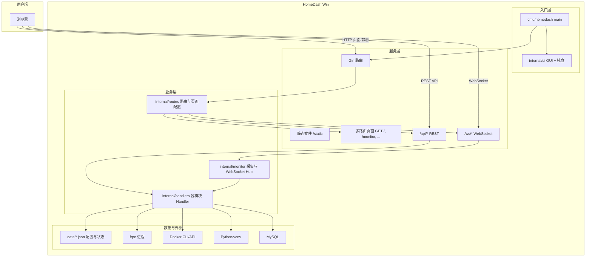
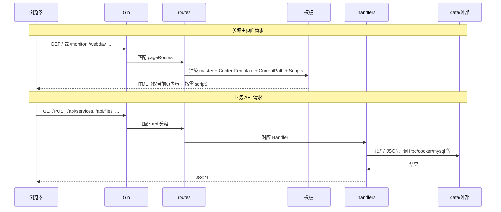
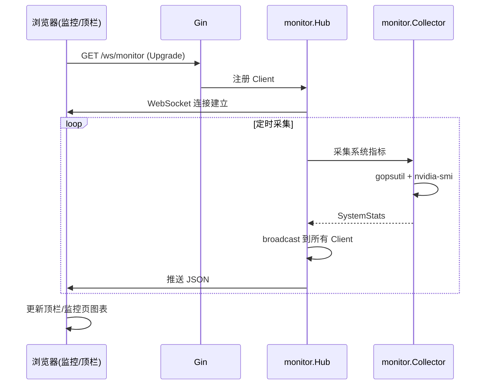
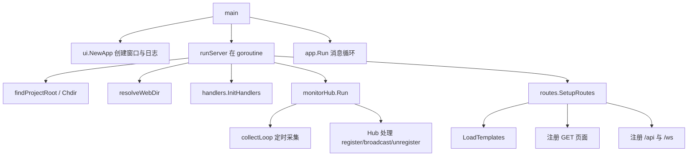

# HomeDash Win 补充说明

## 一、产品技术优势

| 维度 | 说明 |
|------|------|
| **单一可执行文件** | 后端为 Go 编译为单 exe，无运行时依赖，部署即运行；可选 windowsgui 子系统，无黑窗。 |
| **多路由独立页面** | 非传统 SPA 全量加载，每个功能对应独立路由与内容模板，首屏只渲染当前页，按需加载对应 JS，首屏与内存更友好。 |
| **模块化前端** | 公共逻辑在 base.js，各模块（webdav、frpc、websites、database、terminal 等）独立脚本，仅在对应页面加载，避免全局 null 与脚本冲突。 |
| **实时监控链路清晰** | 监控数据由独立 monitor 包采集（gopsutil + nvidia-smi），经 Hub 广播给所有 WebSocket 客户端，前后端职责分离、便于扩展。 |
| **配置与数据分离** | 服务、数据库、网站、FRP、设置等均以 JSON/TOML 存于 data 或可配置目录，便于备份、迁移与版本管理。 |
| **Windows 原生集成** | 系统托盘、开机自启、进程启停、端口检测等均针对 Windows 设计，与家庭服务器使用场景匹配。 |
| **技术栈简单** | 后端 Go + Gin，前端原生 HTML/CSS/JS + Go template，无重框架，便于二次开发与长期维护。 |

---

## 二、目标用户

| 用户类型 | 典型场景 |
|----------|----------|
| **家庭服务器/ NAS 使用者** | 一台 Windows 主机跑多种服务（媒体、网盘、相册等），需要统一入口、状态一览与简单运维。 |
| **个人开发者 / 小团队** | 在本机或内网服务器上跑 Python 网站、MySQL、Docker，需要集中管理项目启停、数据库与容器。 |
| **内网穿透用户** | 使用 FRP 等将内网服务暴露到公网，需要可视化配置与启停、状态查看。 |
| **轻量运维 / 自学运维** | 希望用浏览器完成进程查看、文件管理、Web 终端、日志查看，减少反复远程桌面或 SSH。 |
| **不想折腾复杂面板的用户** | 不需要 Kubernetes 或重型面板，希望一个 exe、一个端口、一个页面解决日常管理需求。 |

---

## 三、系统框架图（Mermaid）



---

## 四、源代码文件组织架构图（Mermaid）

```mermaid
flowchart LR
    subgraph 根目录
        go_mod[go.mod]
        readme[README.md]
        release[release.ps1]
    end

    subgraph cmd["cmd/"]
        homedash["homedash/main.go\n(入口、runServer、resolveWebDir)"]
    end

    subgraph internal["internal/"]
        subgraph routes["routes/"]
            routes_go["routes.go\n(页面路由、API 分组、WebSocket 注册)"]
        end

        subgraph handlers["handlers/"]
            h_services[services.go]
            h_monitor[monitor.go]
            h_process[process.go]
            h_frpc[frpc.go]
            h_terminal[terminal.go]
            h_docker[docker.go]
            h_webdav[webdav.go]
            h_websites[websites.go]
            h_database[database.go]
            h_comfyui[comfyui.go]
            h_logs[logs.go]
            h_settings[settings.go]
            h_template[template.go]
            h_types[types.go]
            h_utils[utils.go]
            h_validator[validator.go]
        end

        subgraph monitor["monitor/"]
            collector[collector.go\n(系统指标采集)]
            websocket[websocket.go\n(Hub / Client / 广播)]
        end

        subgraph ui["ui/"]
            app[app.go\n(GUI 窗口、托盘、日志)]
            exec[exec.go]
            icon[icon.go]
            manifest[manifest.go]
        end
    end

    subgraph web["web/"]
        subgraph templates["templates/"]
            layouts["layouts/master.html"]
            partials["partials/navbar, footer"]
            pages["pages/*.html\n(各页内容模板)"]
        end
        subgraph static["static/"]
            css["css/*.css"]
            js_base["js/base.js"]
            js_page["js/webdav, frpc, terminal,\nwebsites, database..."]
            images["images/"]
        end
    end

    subgraph data["data/"]
        json["*.json\n(services, settings,\ndatabases, websites)"]
        frpc_toml[frpc.toml]
    end

    homedash --> routes_go
    homedash --> handlers
    homedash --> monitor
    homedash --> ui
    routes_go --> handlers
    routes_go --> layouts
    routes_go --> pages
    handlers --> template
    handlers --> monitor
    static --> Browser[浏览器]
```

**目录说明摘要**

| 路径 | 职责 |
|------|------|
| `cmd/homedash/` | 程序入口：GUI 初始化、日志重定向、runServer（Gin、路由、端口）、工作目录与 web 目录解析。 |
| `internal/routes/` | 注册所有 GET 页面路由、/api 与 /ws 分组，将请求分发到对应 handler。 |
| `internal/handlers/` | 各功能 HTTP Handler（服务、监控、进程、FRP、终端、Docker、WebDAV、网站、数据库、ComfyUI、日志、设置、模板加载）。 |
| `internal/monitor/` | 系统指标采集（collector）、WebSocket Hub 与客户端管理（websocket），定时推送监控数据。 |
| `internal/ui/` | Windows GUI：主窗口、托盘、日志框、链接打开等。 |
| `web/templates/` | Go html/template：master 布局、navbar/footer、各页内容块。 |
| `web/static/` | 静态资源：CSS、base.js、各页独立 js、图片。 |
| `data/` | 运行时配置与状态（JSON/TOML），便于备份与迁移。 |

---

## 五、组件交互示意图（Mermaid）

### 5.1 页面请求与 API 请求流



### 5.2 监控 WebSocket 数据流



### 5.3 启动与初始化顺序



---

以上内容从**产品技术优势**、**目标用户**、**系统框架**、**源码结构**和**组件交互**五方面对 HomeDash Win 做了补充说明，便于对外介绍与二次开发参考。
